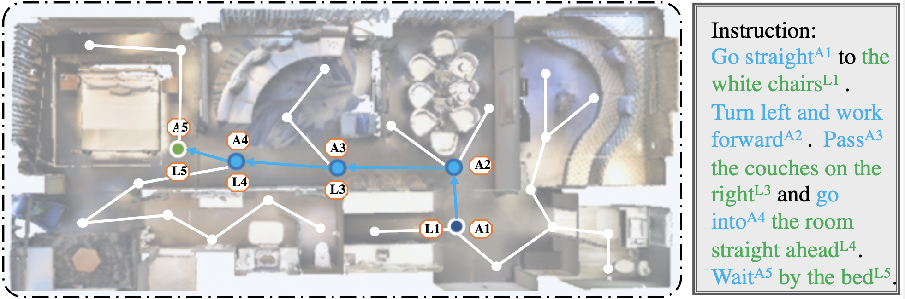

## Learning Disentanglement with Decoupled Labels for Vision-Language Navigation (ECCV'22)

## Introduction
We manually extend the benchmark dataset Room-to-Room with landmark- and action-aware labels in order to provide fine-grained information for each viewpoint. Below figure shows an illustration of decoupled labels providing intermediate supervision during navigation. The superscripts in the instruction denote the landmark and action labels for each viewpoint. The decoupled labels not only contain disentangled information, but help the alignment between vision and language modalities.



## LAR2R
The annotations are stored in directory ``LAR2R/``. Note the json files only contain annotated index, without original instruction. Next, we present an example to show the file structure.
```
{'9f0079fa767e402cb515c7751a13e265': {'0': {'action': [0, 1], 'landmark': [2, 3, 4]},
                                      '1': {'action': [0, 1], 'landmark': [2, 3]},
                                      '2': {'action': [0, 1], 'landmark': [2, 3]}},
 '3abee6c9f9d144cead7d659a476ecb07': {'0': {'action': [6]},
                                      '1': {'action': [5]},
                                      '2': {'action': [16]}},
 '17e450ed7bd2429b81d50ebe770937aa': {'0': {'landmark': [7, 8, 9, 10, 11, 12]},
                                      '1': {'landmark': [6, 7, 8, 9, 10, 11]},
                                      '2': {'landmark': [17, 18, 19, 20, 21, 22, 23, 24, 25, 26]}},
 'id': 9}
```
Here, the json file is a ``dict``, and the first level key is ``path_id``. The above example illustrates the case of one trajectory. ``9f0079fa767e402cb515c7751a13e265`` is the ``viewpoint name``. Then ``0 1 2`` is the ``instruction_id``, which contains the specific index. Note that the index is ``0-based``. We also provide a [simple demo](LAR2R/demo.ipynb) to help better comprehension.

## Installation
1. Please install Matterport3D simulator environment with the [old version (v0.1)](https://github.com/peteanderson80/Matterport3DSimulator/tree/v0.1).

2. Please follow the instructions of [HAMT](https://github.com/cshizhe/VLN-HAMT) to install requirements, and download data. Please put the data in `datasets` directory.


## Training
To train the decoupled label speaker
```
cd r2r_src
bash scripts/run_dls.sh
```

To train the navigator
```
bash scripts/run_r2r.sh
```


## Acknowledgement
This repository is partly built upon [HAMT](https://github.com/cshizhe/VLN-HAMT) and [Recurrent-VLN-BERT](https://github.com/YicongHong/Recurrent-VLN-BERT). Thanks them for their great works!!!
